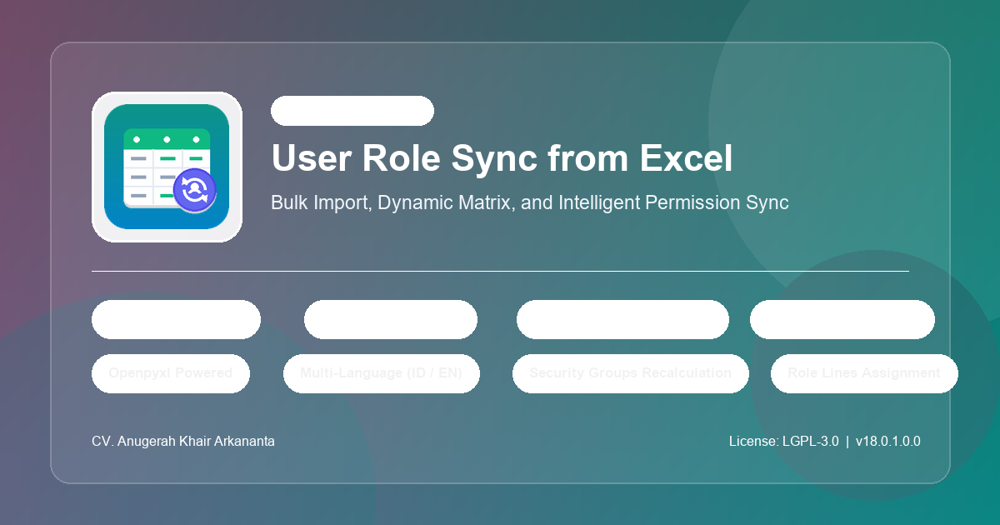

# User Role Sync from Excel (`user_role_sync`)

<div align="center">



<br/><br/>

[](LICENSE)
[](https://www.odoo.com)
[](i18n/)

<br/>

[](README.md)
[](README.en.md)

</div>

---

**User Role Sync from Excel** is an Odoo 16 module that extends the functionality of the OCA [`base_user_role`](https://github.com/OCA/server-auth) module by providing an interactive wizard to import, map, and synchronize user roles in batch directly from Microsoft Excel spreadsheets (`.xlsx`).

---

## 🌟 Key Features

- 📊 **Dynamic Template Generator**: Automatically generates dynamic Excel templates (`.xlsx`) with data-validation dropdowns populated from all installed applications/modules in the active database.
- 👁️ **2-Step Verification & Preview**: Interactive preview grid before applying any changes, allowing you to review matched users, missing users, and assigned target roles.
- 🔘 **Granular Row Selection**: Toggle switch per row and bulk action buttons (*Select All* / *Deselect All*) to process only desired records.
- 🔍 **Multi-Strategy User Matching**: Flexible user resolution by login/username, email address, full display name, or short username (prefix before `@`).
- ➕ **Auto-create Missing Roles**: Automatically creates new `res.users.role` records if roles listed in the spreadsheet do not exist in Odoo yet.
- 👤 **Auto-create Missing Users**: Optional feature to automatically provision new `res.users` accounts when spreadsheet users are missing in the database.
- ⚡ **Instant Group Application**: Immediately refreshes user security groups, menu visibility, and record rules via `set_groups_from_roles(force=True)`.
- 🌐 **Multi-Language (i18n)**: Native English and Indonesian translations using standard GNU gettext (`.po` / `.pot`).
- 🧩 **OCA Compliant**: Fully compliant with the standard OCA `base_user_role` architecture.

---

## 📋 Requirements

### Odoo Modules:
- `base`
- `base_user_role` (OCA)

### Python Libraries:
- `openpyxl` (to read and generate `.xlsx` spreadsheets)

Install the required Python library via pip:
```bash
pip install openpyxl
```

---

## ⚙️ Configuration & Access Rights

Ensure the user running the wizard has either:
- **Administration / Access Rights** or **Administration / Settings**.

---

## 🚀 Usage Guide

### 1. Open the Wizard
Go to **Settings** > **Users & Companies** > **Sync Roles from Excel**.

### 2. Step 1: Upload & Settings (Draft Step)
- *(Optional)* Select template type (*Application Permission Matrix* or *Role Assignment Matrix*) and click **Download Excel Template**.
- Fill user details and access permissions in the downloaded template.
- Upload the `.xlsx` file in the **Excel File (.xlsx)** field.
- Configure options:
  - **Auto-create Missing Roles**: Enable to create roles dynamically.
  - **Auto-create Missing Users**: Enable to provision new `res.users` accounts for users not found in Odoo.
  - **Auto Role Prefix**: Prefix for auto-generated roles (default: `Role -`).
- Click **Load & Preview Data**.

### 3. Step 2: Verification & User Selection (Preview Step)
- The system parses columns and maps users against the database.
- Review user account status:
  - 🟢 **Found in Odoo**: User exists and is ready for sync.
  - 🟡 **To Be Created**: User does not exist and auto-creation is enabled.
  - 🔴 **Not in Odoo**: User was not found (can be manually selected from the dropdown).
- Use **Select All Matched**, **Deselect All**, or individual row toggles.
- Click **Confirm & Apply Roles** to execute synchronization.

### 4. Step 3: Done & Results (Done Step)
- A detailed summary of updated and created users is displayed.
- Click **View Synchronized Users** to jump directly to the users list and check their *User Roles* tab.

---

## 📁 Excel Spreadsheet Formats

### Format 1: Application Permission Matrix (Recommended)
| Name in Excel | Email / Login | Job / Dept | Role Name (Optional) | Sales | Purchase | Inventory | Accounting |
|---------------|---------------|------------|----------------------|-------|----------|-----------|------------|
| John Doe      | john@co.com   | Sales Lead | Role - Sales Lead    | Create, Read, Edit | Read Only | - | - |
| Jane Smith    | jane@co.com   | Staff Admin| Role - Staff Admin   | Read Only | Create, Read, Edit | Read Only | - |

*Supported Permission Values:*
- `Create, Read, Edit` / `Manager` / `Admin` / `Full`: Manager / Full access.
- `Read Only` / `User` / `View`: Read / User access.
- `-` / `None` / Empty: No access to the module.

### Format 2: Role Assignment Matrix (Standard User-to-Roles)
| Name in Excel | Email / Login | Job / Dept | Roles (Comma-separated) | Is Enabled (True/False) |
|---------------|---------------|------------|-------------------------|-------------------------|
| John Doe      | john@co.com   | Sales Lead | Role Sales Lead, Role Logistic | True             |
| Jane Smith    | jane@co.com   | Staff Admin| Role Staff Admin               | True             |

---

## 👥 Contributors & Copyright

* **CV. Anugerah Khair Arkananta** (<info@arkananta.id>)
* Repository: [https://github.com/lalaingampus/odoo_user_role_sync](https://github.com/lalaingampus/odoo_user_role_sync)

---

## 📄 License

This module is licensed under **LGPL-3.0** or later.  
See the [GNU Lesser General Public License](https://www.gnu.org/licenses/lgpl-3.0.html) for details.
