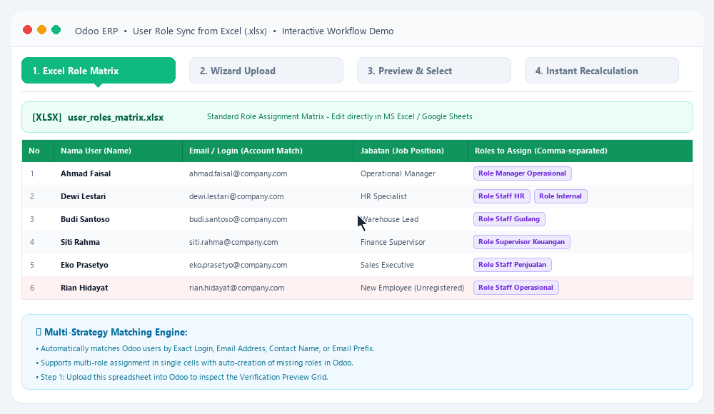

# User Role Sync from Excel (`user_role_sync`)

<div align="center">



<br/><br/>

[](LICENSE)
[](https://www.odoo.com)
[](i18n/)

<br/>

[](README.md)
[](README.en.md)

</div>

---

**User Role Sync from Excel** adalah modul Odoo 17 yang memperluas fungsionalitas modul OCA [`base_user_role`](https://github.com/OCA/server-auth) dengan menyediakan wizard interaktif untuk mengimpor, memetakan, dan menyinkronkan hak akses user (*User Roles*) secara massal (*batch*) langsung dari spreadsheet Microsoft Excel (`.xlsx`).

---

## 🌟 Fitur Utama (Key Features)

- 📊 **Dynamic Template Generator**: Menghasilkan template Excel otomatis (`.xlsx`) dengan dropdown validasi yang disesuaikan secara dinamis dengan seluruh aplikasi/modul Odoo yang terpasang di database.
- 👁️ **2-Step Verification & Preview**: Menampilkan tabel preview interaktif sebelum sinkronisasi dieksekusi, sehingga Anda dapat memverifikasi user yang cocok (*matched*), user yang belum terdaftar (*missing*), dan target role.
- 🔘 **Granular Row Selection**: Mendukung pemilihan per-baris (*toggle switch*) serta tombol aksi massal (*Pilih Semua* / *Batal Pilih*) untuk mengeksekusi sinkronisasi hanya pada user yang diinginkan.
- 🔍 **Multi-Strategy User Matching**: Pencocokan akun user Odoo secara fleksibel (berdasarkan *login/username*, *email*, nama lengkap, maupun *short login* sebelum tanda `@`).
- ➕ **Auto-create Missing Roles**: Secara otomatis membuat role baru di `res.users.role` jika role yang ada di spreadsheet belum terdaftar di Odoo.
- 👤 **Auto-create Missing Users**: Opsi untuk membuat akun login `res.users` baru secara otomatis jika data user di Excel belum ada di database.
- ⚡ **Instant Group Application**: Menerapkan hak akses, *menu visibility*, dan *record rules* secara instan ke user via `set_groups_from_roles(force=True)`.
- 🌐 **Multi-Language (i18n)**: Mendukung Bahasa Indonesia dan English secara native menggunakan GNU gettext standard (`.po` / `.pot`).
- 🧩 **OCA Compliant**: 100% kompatibel dengan arsitektur standar OCA `base_user_role`.

---

## 📋 Prasyarat & Ketergantungan (Requirements)

### Modul Odoo:
- `base`
- `base_user_role` (OCA)

### Library Python:
- `openpyxl` (untuk membaca dan menulis file spreadsheet `.xlsx`)

Install library Python yang dibutuhkan via pip:
```bash
pip install openpyxl
```

---

## ⚙️ Konfigurasi & Hak Akses (Configuration)

Pastikan user yang menjalankan wizard memiliki hak akses:
- **Administration / Access Rights** atau **Administration / Settings**.

---

## 🚀 Panduan Penggunaan (Usage Guide)

### 1. Buka Menu Wizard
Buka menu **Settings** > **Users & Companies** > **Sync Roles from Excel**.

### 2. Langkah 1: Upload & Opsi (Draft Step)
- *(Opsional)* Pilih format template (*Application Permission Matrix* atau *Role Assignment Matrix*) lalu klik **Download Excel Template**.
- Isi data user dan hak akses pada template Excel yang telah diunduh.
- Unggah file `.xlsx` yang sudah diisi pada field **Excel File (.xlsx)**.
- Atur opsi:
  - **Auto-create Missing Roles**: Aktifkan untuk membuat role baru jika belum ada.
  - **Auto-create Missing Users**: Aktifkan jika ingin membuat akun user baru secara otomatis untuk user yang belum terdaftar di Odoo.
  - **Auto Role Prefix**: Prefix nama role otomatis (default: `Role -`).
- Klik tombol **Muat & Cek Preview Data**.

### 3. Langkah 2: Pengecekan & Verifikasi (Preview Step)
- Sistem akan memetakan kolom dan mencocokkan user di database Odoo.
- Tinjau status user:
  - 🟢 **Ditemukan di Odoo**: User terdaftar dan siap disinkronkan.
  - 🟡 **Akan Dibuat Otomatis**: User belum ada dan opsi buat user otomatis aktif.
  - 🔴 **Belum Ada di Odoo**: User tidak ditemukan (dapat dipilih manual pada dropdown *User di Odoo*).
- Gunakan tombol **Pilih Semua**, **Batal Pilih**, atau centang/toggle switch **Pilih** pada baris data yang ingin diproses.
- Klik **Konfirmasi & Terapkan Role** untuk menerapkan sinkronisasi.

### 4. Langkah 3: Selesai & Hasil (Done Step)
- Ringkasan hasil sinkronisasi akan ditampilkan.
- Klik **Lihat Data di Users (Tab User Roles)** untuk langsung memeriksa daftar user dan role yang telah diperbarui.

---

## 📁 Format Spreadsheet Excel

### Tipe 1: Application Permission Matrix (Rekomendasi)
| Nama User | Email/Login | Jabatan/Dept | Role Name (Opsional) | Sales | Purchase | Inventory | Accounting |
|-----------|-------------|--------------|----------------------|-------|----------|-----------|------------|
| John Doe  | john@co.com | Sales Lead   | Role - Sales Lead    | Create, Read, Edit | Read Only | - | - |
| Jane Smith| jane@co.com | Staff Admin  | Role - Staff Admin   | Read Only | Create, Read, Edit | Read Only | - |

*Nilai Izin yang Didukung:*
- `Create, Read, Edit` / `Manager` / `Admin` / `Full`: Hak akses penuh/manager ke modul tersebut.
- `Read Only` / `User` / `View`: Hak akses user/melihat ke modul tersebut.
- `-` / `None` / Kosong: Tidak diberikan akses ke modul tersebut.

### Tipe 2: Role Assignment Matrix (Standard User-to-Roles)
| Nama User | Email/Login | Jabatan/Dept | Roles (Pisahkan Koma Jika Banyak) | Is Enabled (True/False) |
|-----------|-------------|--------------|-----------------------------------|-------------------------|
| John Doe  | john@co.com | Sales Lead   | Role Sales Lead, Role Logistic    | True                    |
| Jane Smith| jane@co.com | Staff Admin  | Role Staff Admin                  | True                    |

---

## 👥 Kontributor & Hak Cipta (Contributors)

* **CV. Anugerah Khair Arkananta** (<info@arkananta.id>)
* Website: [https://github.com/lalaingampus/odoo_user_role_sync](https://github.com/lalaingampus/odoo_user_role_sync)

---

## 📄 Lisensi (License)

Modul ini dilisensikan di bawah **LGPL-3.0** atau yang lebih baru.  
Lihat [GNU Lesser General Public License](https://www.gnu.org/licenses/lgpl-3.0.html) untuk detail lebih lanjut.
